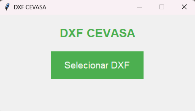
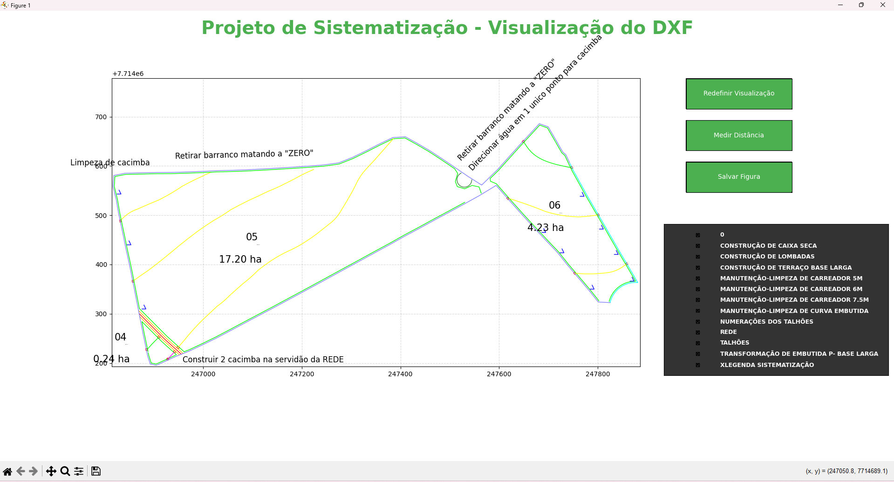
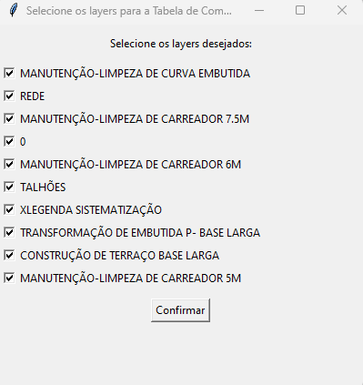
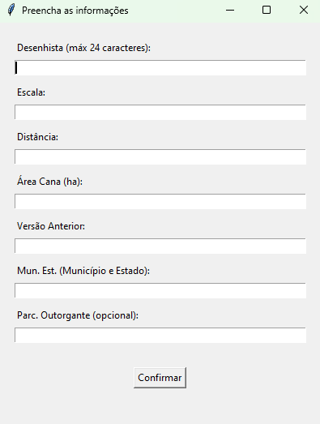
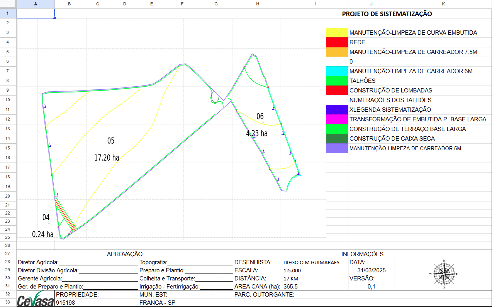
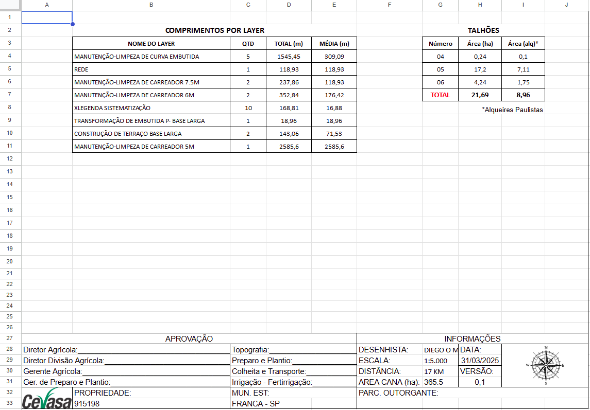

# 📐 DXF - CEVASA

The system is a specialized solution developed to simplify and automate the processing of DXF files (standard format used by CAD software like AutoCAD), with the goal of generating detailed and accurate reports and spreadsheets for agricultural systematization projects, especially for planting.

---

## ✅ Features

- 📁 Intuitive interface for selecting `.dxf` files  
- 🗺️ Interactive DXF map visualization with layer filters  
- 📏 Direct measurement tool on the map  
- 🧾 Automatic generation of:  
  - **Line length by layer** table  
  - **Field plots** table  
  - Legend with colors and layer names  
- 🖼️ Automatic insertion of the map image  
- 📄 Excel spreadsheet + PDF generation  
- 🧩 Custom icon  
- 🔒 Clean interface, no terminal window in the packaged version  

---

## 🖥️ Initial Interface

  

System start screen. By clicking **“Select DXF”**, you choose the topographic file to be processed.

---

## 🗺️ Interactive DXF Visualization

  

The system automatically renders the map extracted from the DXF, preserving colors, texts, and geometries.  
On the right side, you have buttons to reset the view, measure distances, and save the final figure.

---

## ✅ Layer Filters

  

Before generating the spreadsheet, the system allows you to select **which layers should be included in the calculations**.

---

## ✅ Fill Excel

  

After confirming the filters, the system shows this window **to enter the information into the spreadsheet**.

The draftsman field will always save the last name entered to speed up the process.

---

## 📄 Map and Legend Generated in the Spreadsheet

  

The generated spreadsheet includes:

- Rendered DXF map  
- Automatic legend based on the used layers  
- Auto-filled data:
  - **Current date**  
  - **Version (incremental)**  
  - Property name (DXF file name)  
  - Sugarcane area, scale, distance (entered by the user)  

---

## 📊 Length and Field Plot Tables

  

Based on the DXF lines, the system calculates:

- **Length by layer** (quantity, total, and average)  
- **Area by plot**, in hectares and alqueires  
- **Total cultivable area**

> 🔄 The tables are automatically generated based on visible layers and texts near the geometries.
