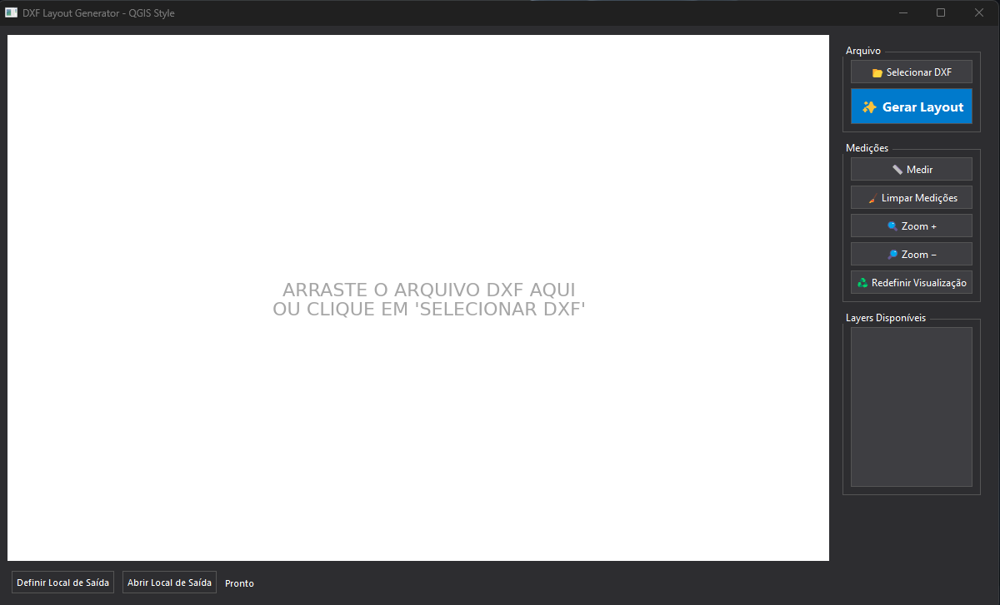
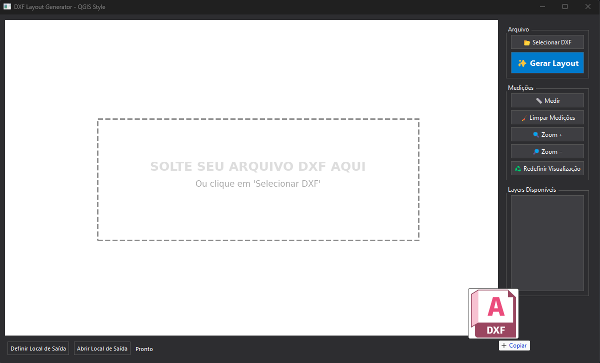
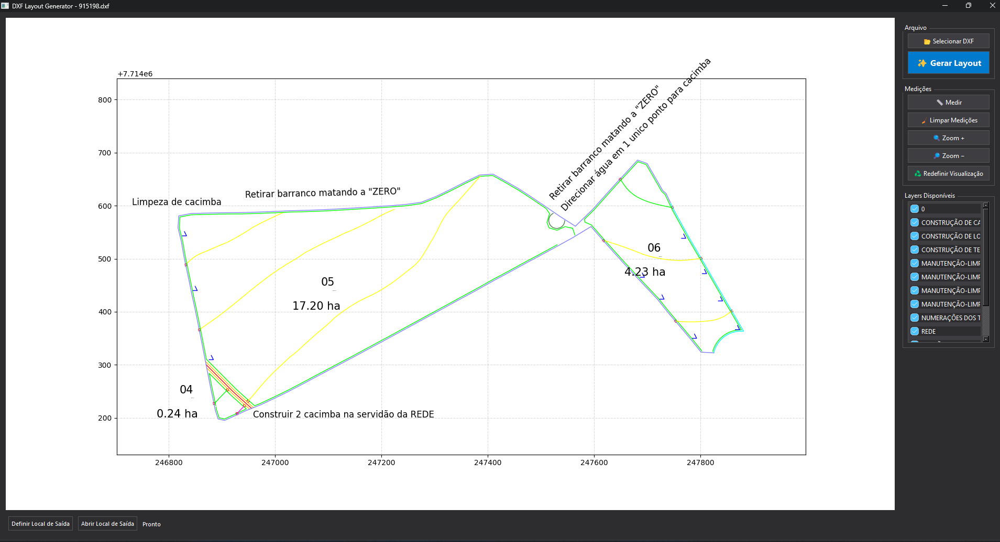
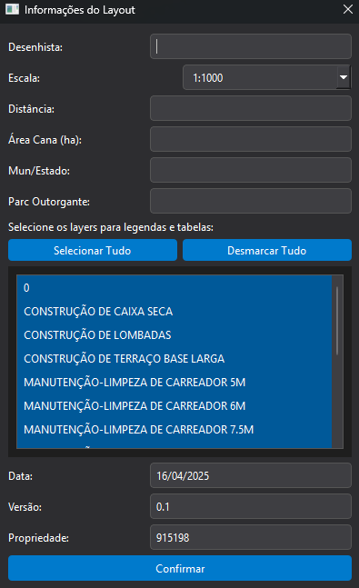
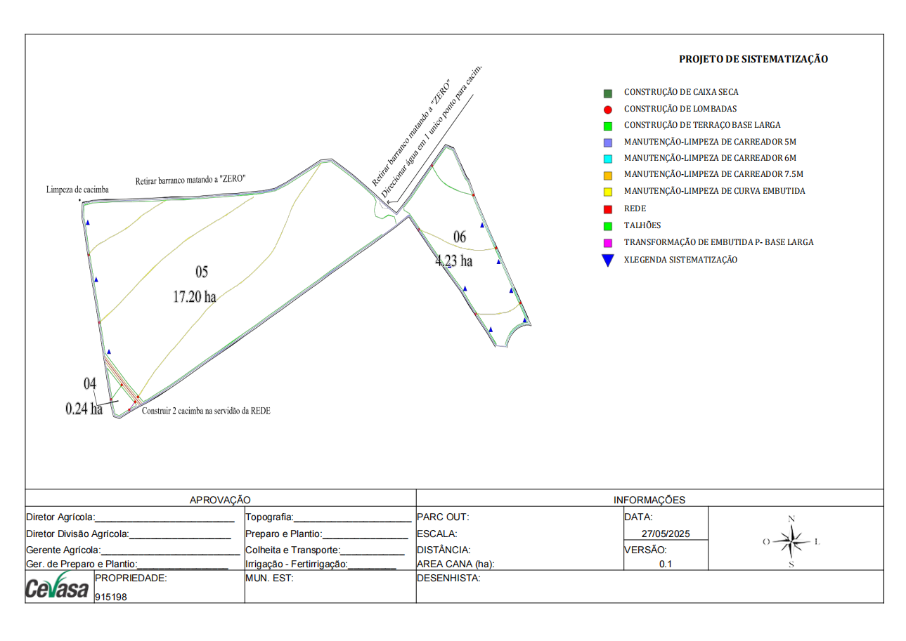
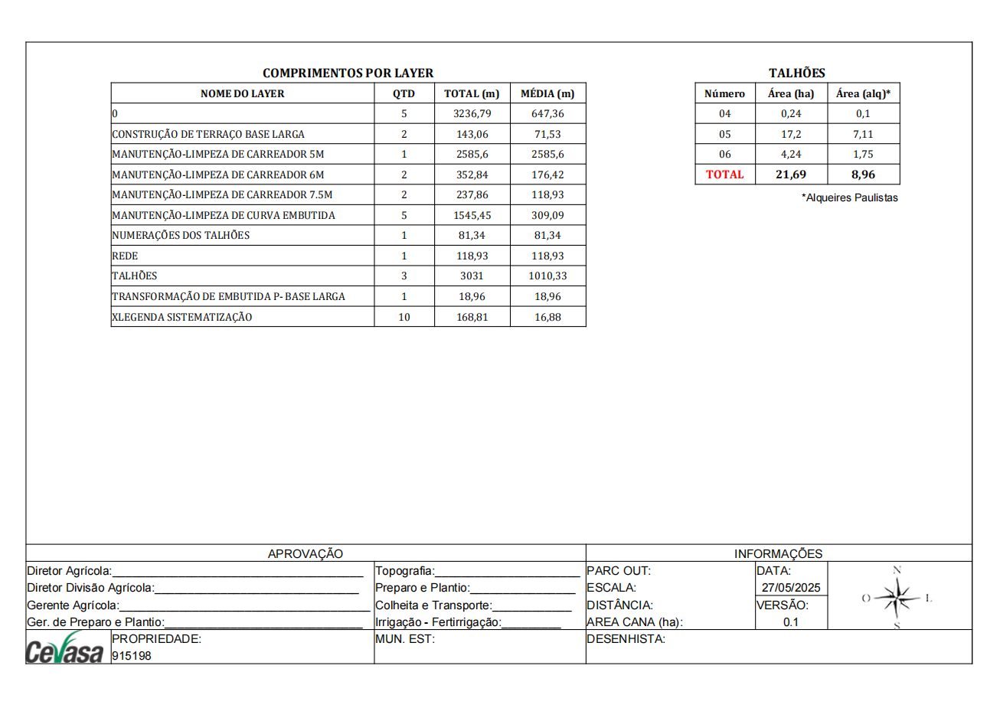

📐 DXF - CEVASA
The system is a specialized solution developed to simplify and automate the processing of DXF files (a standard format used by technical drawing software such as AutoCAD), aiming to generate detailed and accurate reports and spreadsheets for agricultural systematization projects, especially for planting.

✅ Features
📁 Intuitive interface for selecting .dxf files

🗺️ Interactive DXF map viewer with layer filters

📏 Direct measurement tool on the map

🧾 Automatic generation of:

Length by layer table

Plot division table

Legend with layer names and colors

🖼️ Automatic insertion of the map image

📄 Excel spreadsheet + PDF generation

🧩 Custom icon

🔒 Clean interface, no terminal window in the packaged version

<h3 align="center">🎬 Project Demo</h3> 
  

🖥️ Initial Interface

  
 
  

🗺️ Interactive DXF Viewer

  

The system automatically renders the map extracted from the DXF, preserving colors, texts, and geometries.
On the right panel, you have buttons to reset view, measure distances, and save the final image.

✅ Spreadsheet Entry and Layer Filters

  

The "Designer" field always saves the last entered name to speed up the process.

Before generating the spreadsheet, the system allows you to choose which layers should be included in the calculations.

📄 Map and Legend Generated in the Spreadsheet

  
 
  

The spreadsheet includes:

Rendered DXF map

Automatically generated legend based on used layers

Automatically filled fields:

Current date

Version (incremental)

Property name (from the DXF file)

Cane area, scale, distance (entered by user)

📊 Length and Plot Tables
Based on the lines in the DXF, the system calculates:

Length per layer (count, total, and average)

Area per plot, in hectares and alqueires

Total cultivable area

🔄 The tables are generated automatically based on visible layers and text near the geometries.

